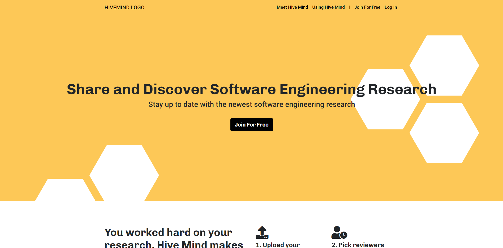
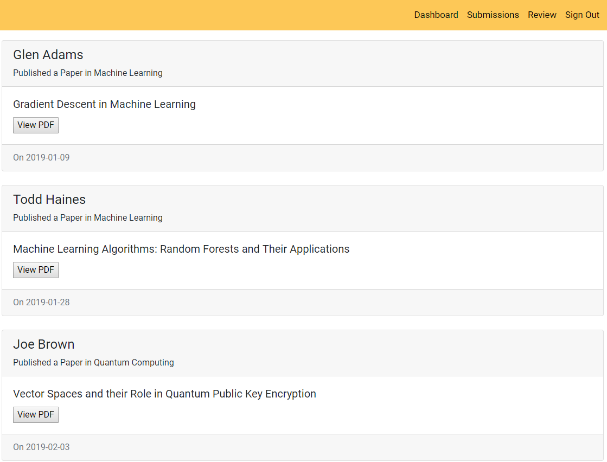
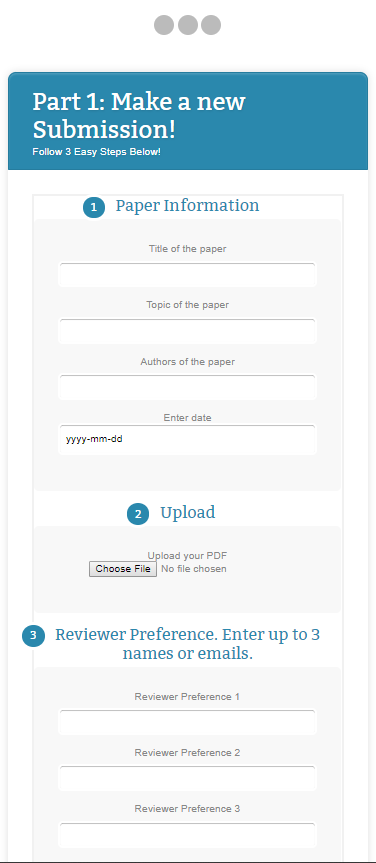
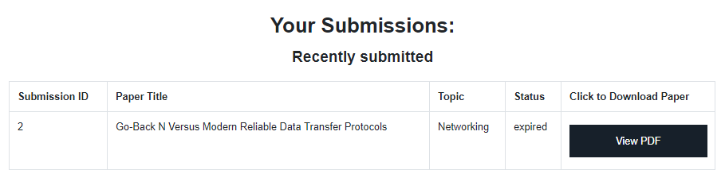
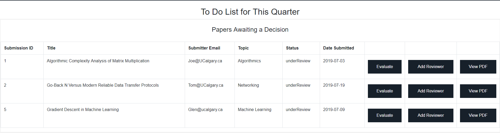
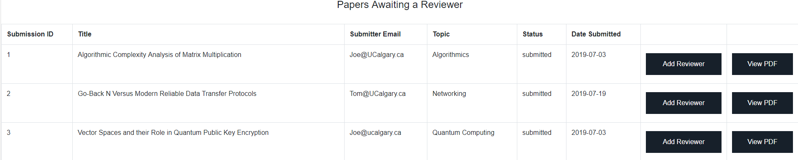

# SENG 300 - Hive Mind Project

## Authors
FredReinink, panktiHT, nmoton, and JanetLeahy.

## About
Created for Software Engineering 300 in Spring 2019, this project models an academic journal submission and review system.  
  
Users can submit their papers, request reviews, receive feedback, and have their papers displayed in the journal.  
Approved users (reviewers) can submit their own papers, review other papers, and submit their feedback/publishing recommendations to the journal editor.  
Journal editors can assign reviewers to review papers, can review papers themselves, can view reviewer feedback on each paper and choose to publish/reject submitted papers.  

## Methods
Uses HTML, CSS, and Bootstrap for the frontend. mySQL handles the database and PHP covers all backend code.

This project was developed according to software engineering best practices. The development process involved user stories, project backlogs, and sprint meetings under an Agile Scrum framework.

## Screenshots

;
;
;
;
;
;
;
